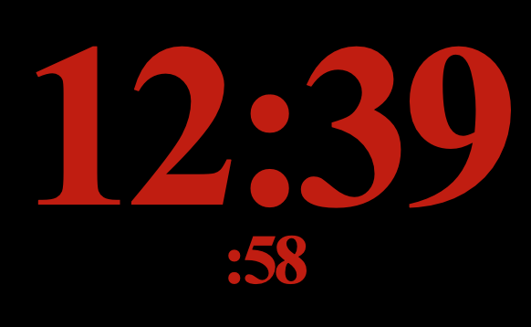

# Without-My-Glasses Clock Screensaver

Displays a simple hours:minutes clock on OS X as a 
screensaver, in the biggest font that will fit on
screen.  Uses red text with a black background so
you can use it in a darkened bedroom without disturbing
your sleep.

I'm not really an OS X developer, so there are probably
bugs and possibly memory leaks in this code.  Use at
your own risk.

## Background

Need a clock you can read from bed without your glasses?  
This might do the trick!

After many nights sitting up with my newborn, who was
nursing roughly every two hours, I found the hours
started to blur together. I was keeping the room fairly
dark so he would fall back asleep easily, and didn't want
to hunt up and put on my glasses just to read a clock. A
wristwatch was useless without my hands free to push a 
light-up button, and a smartwatch was out of my price range.

A search for large digital-display wall clocks was useless.
The largest text size was about 4", and I needed at least 6"
to see it from bed without my glasses.  I could find a few
specialty clocks, but they came with a high price.  

Then I realized that a computer monitor was about the right 
size to display a digital clock and be able to read it from across
the room.

There weren't any screensavers that displayed smoothly with
minimal animations and red text, so I wrote one.

See the release/ directory for the compiled screensaver that you
can download and install.

# License

Download and use for free for personal use.  I maintain full copyright.

